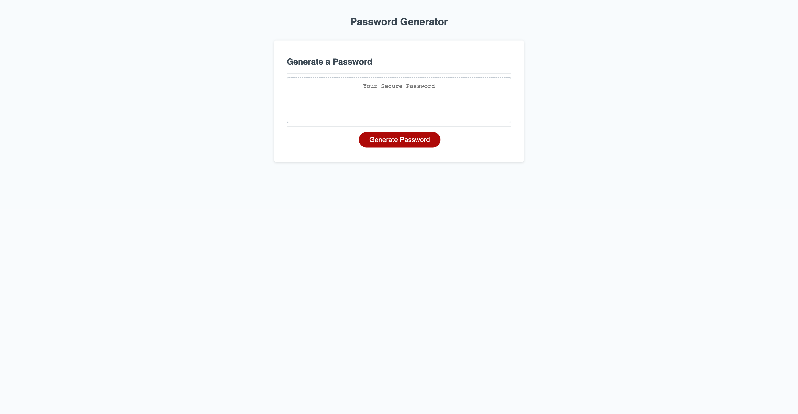

# Random Password Generator

## Accepts user's criteria for a unique, randomly generated password. User can select whether they want lower-case, upper-case, numbers, or special characters. Password can be 8-128 characters in length.

## https://ianjustinferris.github.io/random_Password_Generator/

